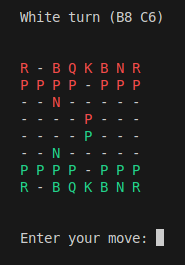

Command line chess game written in python



### Setup

Install uv via pip if you don't have it already

```
pip install uv
```

Install dependencies

```
uv pip install
```

### Run

```
uv run python main.py
```

To store the game state in [FEN](https://www.chess.com/terms/fen-chess) format, pass a file name to use as a log. You can then exit and restart from the state where you left of.

```
uv run python main.py game.txt
```

### Test

```
uv run pytest
```